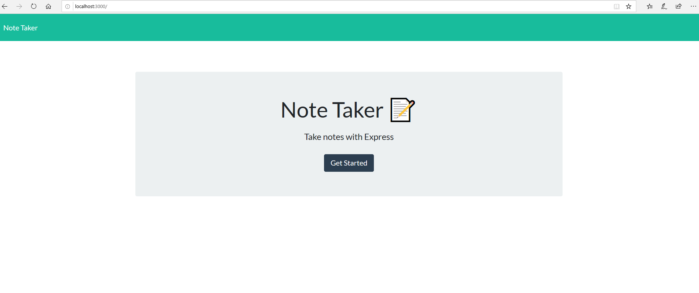
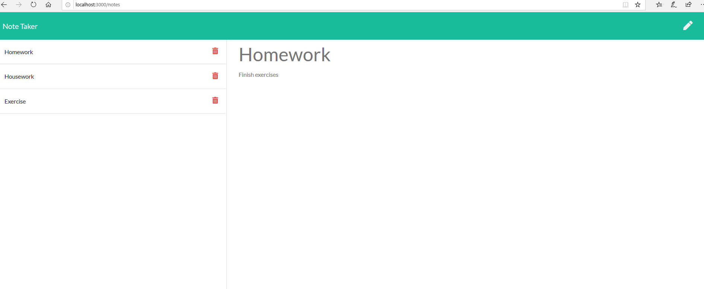

# Note-Taker

## Description

The following application introduces server-side coding to create an application that makes it possible to add and delete notes.
 

## Table of Contents

  * [User-Story](#User-Story)

  * [Installation](#installation)

  * [Usage](#usage)

  * [Questions?](#questions)

## User-Story

AS A user, I want to be able to write and save notes

I WANT to be able to delete notes I've written before

SO THAT I can organize my thoughts and keep track of tasks I need to complete

 
 

## Installation
Clone the repistory and type npm install in the terminal with the correct working directory

## Usage 
After typing 'node server.js', collect to your local host to see the webpage. Alternatively follow copy the link to see the deployed application via Heroku.

## Video-Links

https://drive.google.com/file/d/1FvoyAcUgWgdRW_aWx152vueSQ7sb52QA/view

## Questions?

  GitHub: http://github.com/thomasmaglaris
  Email: thomasmaglaris@gmail.com

Thomas Maglaris. 